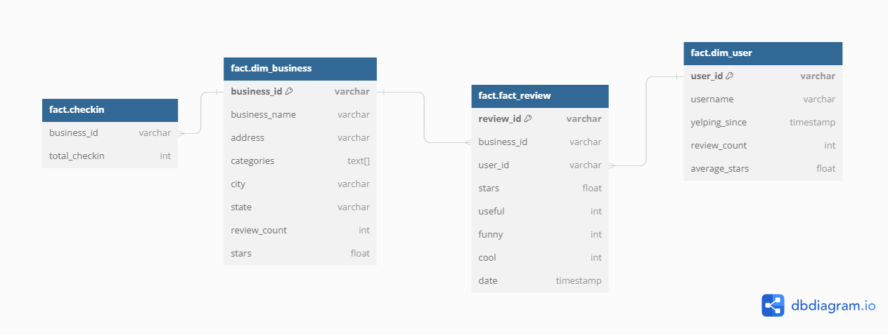

## ETL Yelp Dataset Pipeline


This project implements an ETL pipeline to process Yelp dataset's JSON data. The pipeline extracts data from the JSON files, performs necessary transformations, and loads the cleaned data into a PostgreSQL database.

## Table of Contents

- [Description](#description)
- [Installation](#installation)
- [Usage](#usage)
- [JSON Data Structure](#json-data-structure)
- [Transformation](#transformation)
- [Loading](#loading)
- [Database Connection](#database-connection)
- [Executing SQL Files](#executing-sql-files)
- [Inserting JSON Data](#inserting-json-data)
- [Entity-Relationship Diagram (ERD)](#entity-relationship-diagram-erd)
- [Contributing](#contributing)
- [License](#license)

## Description

The Yelp dataset contains a wealth of information, including reviews, business details, user profiles, and more. This ETL pipeline efficiently processes the JSON data and prepares it for further analysis, reporting, or integration with other systems.

## Installation

1. Clone the repository:

```bash
git clone https://github.com/ayusha-stack/etl-yelp.git
cd etl-yelp-
``````


## Usage

To run the ETL pipeline, follow these steps:

1. Place the Yelp dataset JSON files in the `data/` directory.
2. Ensure you have set up a PostgreSQL database and have its credentials in a `.env` file in the root directory of the project. The `.env` file should contain the following variables:


The cleaned and transformed data will be loaded into the PostgreSQL database.

## JSON Data Structure

The Yelp dataset's JSON files have the following structure:

- `business.json`: Contains information about businesses, such as name, address, categories, and ratings.
- `review.json`: Contains user reviews for different businesses, including text and star ratings.
- `user.json`: Contains user profiles and associated data.
- `checkin.json`: Contains information related to business check-ins.
- `tip.json`: Contains information about tips given by users.

## Transformation

The data transformation process includes:

- Data cleaning: Handling missing values, removing duplicates, etc.
- Data normalization: Converting data into a consistent format.

## Loading

The cleaned and transformed data is loaded into a PostgreSQL database for further analysis or reporting.

## Database Connection

The provided code in `connection.py` establishes a connection to the PostgreSQL database using the `psycopg2` library. It reads the necessary database credentials from the `.env` file using `dotenv`.

## Executing SQL Files

The `execute_sql_files` function in `execute.py` allows you to execute SQL files using a database cursor. This function reads the SQL query from the specified SQL file and executes it against the connected database.

## Inserting JSON Data

The `insert_json_data` function in `insert.py` is responsible for inserting JSON data from a file into a specified database table. It reads the JSON file line by line and inserts each line's data into the corresponding table using an SQL `INSERT` statement.

## Entity-Relationship Diagram (ERD)



The ERD visualizes the relationships between the fact and dimension tables in the database.

## Running the file

main.py is the program which runs entire pipeline.


